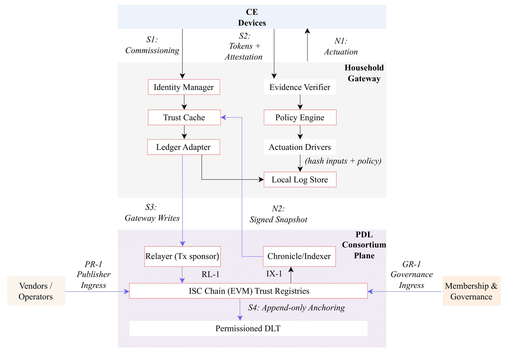

# Revocable and Lightweight Gateway-Centric Trust for Consumer Electronics Using Distributed Ledger Technology

Consumer electronics increasingly execute integrated sensing–communication–computing–control (ISCCC) loops locally, making trust, revocation, and audit at the moment of action the bottleneck. We propose an architecture that keeps action-time authorization on the household gateway, while synchronizing cross-vendor trust state off-path via a permissioned trust registry. Devices do not write to the ledger; instead, the gateway periodically anchors succinct commitments (Merkle roots and policy/model digests). We prototype the registry on an IOTA DLT and evaluate three questions: (i) Off-path anchoring: under microbursts of size-triggered commits, ledger time-to-confirmation (TTC) is narrow and milestone-dominated (median ≈ 3.9–4.0 s; P95 ≈ 4.2 s at a ~10 s coordinator cadence), independent of burst size; (ii) Registry reaction: the gateway’s reaction time E[T_rev] ≈ Δ_snap/2 + E[T_TTC] (plus a sub-second probe term), confirmed by CDF/box-plot shifts between Δ_snap = 15 s and Δ_snap = 60 s; and (iii) Partition tolerance: across normal, impaired, offline, and recovery phases, local decision latency remains sub-millisecond (with only a few-ms “caution” jitter when snapshots age), and anchoring resumes within the same 1–5 s TTC envelope on recovery. The results validate that action-time decisions stay within tens-of-milliseconds budgets while trust synchronization is predictable and tunable; we recommend Δ_snap ≈ 10–15 s for “hot” items (keys/ownership) and Δ_snap ≥ 60 s for “warm/cold” items (recalls/model checkpoints).

[](SI-consumer-electronics-1.png)


---

## Components

- **DLT-Adapter**: Verifies identity, filters redundant data, submits model hashes to Tangle.
- **DLT-Verifier**: Validates updates, assigns reputation scores.
- **DLT-Aggregator**: Computes global model from verified updates.
- **DLT-DApp Manager**: Orchestrates interactions among modules.
- **Off-chain Repository**: Stores actual model weights securely.


##  Getting Started

### Prerequisites

- Docker
- Docker Compose

---

### Start the Sandbox

To start the sandbox environment:

```bash
cd ~/iota-sandbox/sandbox
docker compose up -d
```

Check that the containers are running:

```bash
docker ps
```

You should see services like:
- `hornet`
- `inx-coordinator`
- `inx-faucet`
- `traefik`

---

## Steps to Restart & Repeat Your IOTA Sandbox Transaction Tests

Use this section to reset and re-run your transaction testing setup at any time.

---

### Get Hornet’s IP Address

Run the following command to get Hornet's internal Docker IP:

```bash
docker inspect -f '{{range.NetworkSettings.Networks}}{{.IPAddress}}{{end}}' hornet
```

This will return something like:

```
172.18.211.11
```

Copy this IP to use in your API requests.

---

### Verify Hornet is Running

Use the following command to check if Hornet is healthy:

```bash
curl -X GET http://<Hornet-IP>:14265/api/core/v2/info
```

Example:

```bash
curl -X GET http://172.18.211.11:14265/api/core/v2/info
```

If you see `"isHealthy": true`, then Hornet is running correctly.

---

### Send a Test Transaction

```bash
time curl -X POST http://<Hornet-IP>:14265/api/core/v2/blocks \
  -H "Content-Type: application/json" \
  -d '{
    "protocolVersion": 2,
    "parents": [],
    "payload": {
      "type": 5,
      "tag": "0x48656c6c6f2054616e676c65",
      "data": "0x48656c6c6f2054616e676c65"
    }
  }'
```

Example output:

```json
{"blockId":"0xd235e1faf9a96a55d971e0d7139c1b1e43561a204148b379080e5779a18d3075"}
```

---

### Verify the Sent Transaction

Use the `blockId` returned in the previous step:

```bash
curl -X GET http://<Hornet-IP>:14265/api/core/v2/blocks/<blockId>
```

Example:

```bash
curl -X GET http://172.18.211.11:14265/api/core/v2/blocks/0xd235e1faf9a96a55d971e0d7139c1b1e43561a204148b379080e5779a18d3075
```

If you see the block data, the transaction was successfully submitted to the Tangle.

---

### Automate Multiple Transactions (with Latency Logging)

Use this loop to send 10 transactions and log the latency of each:

```bash
for i in {1..10}; do
  echo "Sending transaction #$i..." | tee -a latency_results.txt
  { time curl -X POST http://<Hornet-IP>:14265/api/core/v2/blocks \
    -H "Content-Type: application/json" \
    -d '{
      "protocolVersion": 2,
      "parents": [],
      "payload": {
        "type": 5,
        "tag": "0x546573745472616E73616374696F6E",
        "data": "0x48656c6c6f2054616e676c65"
      }
    }' ; } 2>> latency_results.txt
done
```

Replace `<Hornet-IP>` with the actual IP you got in step 1.

---

## Repository Structure

```
iota-sandbox/
├── docker-compose.yml
├── config_sandbox.json
├── protocol_parameters.json
├── bootstrap.sh
├── .env.example
└── data/           # Local storage (should be ignored by Git)
```

---

## 📄 .gitignore Recommendation

To avoid permission issues and committing unnecessary runtime data, use this `.gitignore`:

```
.env
.env.*
data/
*.log
*.db
*.pid
.vscode/
.DS_Store
```

---

## Contributing

This sandbox is for personal testing and learning. Feel free to fork and modify it for your own IOTA experiments.

---

## 📚 Resources

- [IOTA Hornet Node Documentation](https://wiki.iota.org/hornet/)
- [IOTA Wiki](https://wiki.iota.org/)
- [IOTA GitHub](https://github.com/iotaledger)
