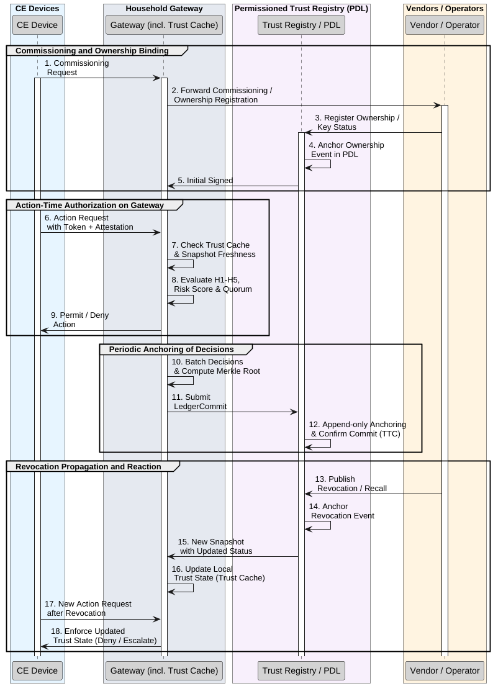

# Revocable and Lightweight Gateway-Centric Trust for Consumer Electronics Using Distributed Ledger Technology

Consumer electronics increasingly execute integrated sensing–communication–computing–control (ISCCC) loops locally, making trust, revocation, and audit at the moment of action the main bottleneck.

This repository provides a sandbox and scripts for a **gateway-centric trust architecture** where:

- Action-time authorization stays on the **household gateway**.
- Cross-vendor trust state is synchronized **off-path** via a **permissioned trust registry** on IOTA.
- Devices **never** write directly to the ledger; the gateway periodically anchors succinct commitments (Merkle roots and policy/model digests).

We prototype the registry on an IOTA DLT and evaluate:

- **Off-path anchoring**: Time-to-confirmation (TTC) is narrow and milestone-dominated  
  (median ≈ 3.9–4.0 s; P95 ≈ 4.2 s at a ~10 s coordinator cadence), independent of burst size.
- **Registry reaction**: Gateway reaction time follows  
  `E[T_rev] ≈ Δ_snap / 2 + E[T_TTC]` (plus a sub-second probe term).
- **Partition tolerance**: In normal, impaired, offline, and recovery phases, local decision latency  
  remains sub-millisecond, with only a few ms of “caution” jitter when snapshots age. Anchoring resumes  
  within the same 1–5 s TTC envelope upon recovery.

**Recommended settings:**

- `Δ_snap ≈ 10–15 s` for **hot** items (keys, ownership).
- `Δ_snap ≥ 60 s` for **warm/cold** items (recalls, model checkpoints).


---

## Table of Contents

- [Architecture Overview](#architecture-overview)
- [Components](#components)
- [System and Trust Model](#system-and-trust-model)
- [Getting Started](#getting-started)
  - [Prerequisites](#prerequisites)
  - [Start the Sandbox](#start-the-sandbox)
- [Running IOTA Transaction Tests](#running-iota-transaction-tests)
  - [Get Hornet’s IP](#get-hornets-ip)
  - [Verify Hornet Health](#verify-hornet-health)
  - [Send a Test Transaction](#send-a-test-transaction)
  - [Verify the Transaction](#verify-the-transaction)
  - [Send Multiple Transactions with Latency Logging](#send-multiple-transactions-with-latency-logging)
- [Experiment Reproduction](#experiment-reproduction)
  - [1. Off-Path Anchoring (TTC)](#1-off-path-anchoring-ttc)
  - [2. Registry Reaction Time vs Δ_snap](#2-registry-reaction-time-vs-Δ_snap)
  - [3. Partition Tolerance](#3-partition-tolerance)
- [Repository Structure](#repository-structure)
- [Recommended Defaults](#recommended-defaults)
- [.gitignore](#gitignore)
- [Contributing](#contributing)
- [Resources](#resources)
- [Citation](#citation)

---

## Architecture Overview

The architecture is designed around a **household gateway** as the trust and decision point:

- All **action-time** decisions (e.g., `door.unlock`, `car.charge.start`) happen locally on the gateway.
- A **permissioned IOTA-based trust registry** acts as a cross-vendor “trust memory”.
- The gateway periodically:
  - Pulls **signed trust snapshots** (ownership, revocations, recalls, digests).
  - Pushes **off-path anchoring commits** (Merkle roots of decision logs + policy/model digests).

This keeps **user-perceived latency** in the tens-of-milliseconds range, while ensuring revocation and audit remain verifiable and cross-vendor.

---

## Components

### Conceptual

- **Household Gateway**  
  Local decision point. Evaluates every capability request against policy, evidence, and trust snapshots.

- **Identity Manager**  
  Handles device onboarding, commissioning, ownership transfers, and key status (valid, revoked, superseded).

- **Evidence Verifier**  
  Verifies:
  - Short-lived, audience-bound authorization tokens (e.g., ACE-OAuth).
  - Attestation evidence (e.g., RATS/EAT, SUIT for firmware and model lineage).

- **Policy Engine**  
  Enforces:
  - Capability rules (who can do what, under which context).
  - Micro-quorums (k-of-n approvals) for high-risk actions across diverse vendors/modalities/paths.

- **Trust Cache**  
  Stores **signed “as-of” snapshots** from the trust registry:
  - Keys/ownership
  - Recalls/quarantines
  - Policy/model digests
  - Other trust states

- **Ledger Adapter (Gateway Client)**  
  Batches local `GatewayDecision` events into `LedgerCommit` payloads:
  - Merkle root of decision log
  - Policy/model digests
  - Metadata (timestamp, snapshot IDs)
  and posts them to the IOTA node. Devices never write to the ledger directly.

- **Permissioned Trust Registry**  
  An IOTA-based registry that stores:
  - Ownership and supersession events
  - Key status and revocations
  - Recalls and quarantines (firmware/model)
  - Policy and model digests
  - Anchored commitments (Merkle roots)

- **Chronicle / Indexer**  
  Provides:
  - Signed “as-of” trust snapshots
  - Consistent heighted view of registry state
  - Freshness guarantees for gateways

---

## System and Trust Model

### Action-Time Decisions Stay Local

Before allowing any sensitive capability, the gateway enforces a set of “hard gates” such as:

1. **Authorization token valid** and bound to session.
2. **Attestation fresh** (evidence age below configured threshold).
3. **Snapshot fresh** (Trust Cache age ≤ `Δ_snap`).
4. **No revocation/quarantine** for the device or model in the registry.
5. **Policy/model digest match** between local state and registry.

If any check fails, the gateway **denies** or **escalates** the request by policy.

### Risk Scoring

When the hard gates pass, the gateway computes a **risk score** based on:

- Attestation age  
- Snapshot age  
- Model age and lineage  
- Anomaly indicators / uncertainty metrics  

The request is allowed only if:

```text
risk(d, c, t) ≤ θ_c
```

where `θ_c` is a threshold that depends on the requested capability (e.g., stricter for `door.unlock` than for `lights.on`).

### Registry as Off-Path “Trust Memory”

The trust registry is **off the action path**:

- Gateways ingest signed snapshots at an interval `Δ_snap`.
- Registry changes (revocations, recalls, ownership events) are written to the ledger and become visible to gateways on the next snapshot.
- Expected reaction time for a revocation/recall is:

```text
E[T_rev] ≈ Δ_snap / 2 + E[T_TTC] + small probe delay
```

### Partition Tolerance

When connectivity is impaired or offline:

- The gateway continues to make **local decisions** based on its Trust Cache.
- If snapshot age exceeds `Δ_snap`, it enters **“caution mode”**:
  - Tightened risk thresholds
  - Stricter quorums
  - Possibly deny-by-default for high-impact actions
- When connectivity recovers:
  - Queued anchors are flushed.
  - Time-to-confirmation returns to the 1–5 s band.
  - Normal mode resumes once new snapshots are ingested.




---

## Getting Started

### Prerequisites

- [Docker](https://www.docker.com/)
- [Docker Compose](https://docs.docker.com/compose/)

---

### Start the Sandbox

From the sandbox directory:

```bash
cd ~/iota-sandbox/sandbox
docker compose up -d
```

Verify containers:

```bash
docker ps
```

You should see services similar to:

- `hornet`
- `inx-coordinator`
- `inx-faucet`
- `traefik`

---

## Running IOTA Transaction Tests

These steps help you verify your Hornet node and perform simple transaction load tests.

### Get Hornet’s IP

```bash
docker inspect -f '{{range.NetworkSettings.Networks}}{{.IPAddress}}{{end}}' hornet
```

Example output:

```text
172.18.211.11
```

Use this IP as `<Hornet-IP>` in subsequent commands.

---

### Verify Hornet Health

```bash
curl -X GET http://<Hornet-IP>:14265/api/core/v2/info
```

Example:

```bash
curl -X GET http://172.18.211.11:14265/api/core/v2/info
```

Look for:

```json
"isHealthy": true
```

---

### Send a Test Transaction

```bash
time curl -X POST http://<Hornet-IP>:14265/api/core/v2/blocks   -H "Content-Type: application/json"   -d '{
    "protocolVersion": 2,
    "parents": [],
    "payload": {
      "type": 5,
      "tag": "0x48656c6c6f2054616e676c65",
      "data": "0x48656c6c6f2054616e676c65"
    }
  }'
```

Example output:

```json
{"blockId":"0xd235e1faf9a96a55d971e0d7139c1b1e43561a204148b379080e5779a18d3075"}
```

---

### Verify the Transaction

```bash
curl -X GET http://<Hornet-IP>:14265/api/core/v2/blocks/<blockId>
```

Example:

```bash
curl -X GET http://172.18.211.11:14265/api/core/v2/blocks/0xd235e1faf9a96a55d971e0d7139c1b1e43561a204148b379080e5779a18d3075
```

You should see the block data for that `blockId`.

---

### Send Multiple Transactions with Latency Logging

This loop sends 10 transactions and appends timing information to `latency_results.txt`:

```bash
for i in {1..10}; do
  echo "Sending transaction #$i..." | tee -a latency_results.txt
  { time curl -X POST http://<Hornet-IP>:14265/api/core/v2/blocks     -H "Content-Type: application/json"     -d '{
      "protocolVersion": 2,
      "parents": [],
      "payload": {
        "type": 5,
        "tag": "0x546573745472616E73616374696F6E",
        "data": "0x48656c6c6f2054616e676c65"
      }
    }' ; } 2>> latency_results.txt
done
```

Replace `<Hornet-IP>` with the actual IP from the earlier step.

---

## Experiment Reproduction

This repository is structured so you can approximate the three main experimental questions.

### 1. Off-Path Anchoring (TTC)

Goal: Measure **time-to-confirmation (TTC)** for `LedgerCommit` payloads under **microbursts** of traffic.

High level procedure:

1. Generate `LedgerCommit` payloads (Merkle root + policy/model digests; ~2–3 kB JSON).
2. Send them to Hornet in bursts with brief idle intervals.
3. Log:
   - Send timestamps
   - Milestone confirmation times
   - `TTC = confirmation_time - send_time`
4. Sweep burst sizes and total commits per run (e.g., 10, 30, 50, 100).

Expected characteristics:

- TTC is **milestone-dominated** (coordinator ~10 s).
- Median TTC ≈ 3.9–4.0 s; P95 ≈ 4.2 s.
- Behavior is largely independent of burst size under reasonable loads.

---

### 2. Registry Reaction Time vs Δ_snap

Goal: Observe how snapshot cadence affects **revocation/recall reaction time** `T_rev`.

Parameters:

- Snapshot cadence:  
  - `Δ_snap = 15 s` (hot items)  
  - `Δ_snap = 60 s` (warm/cold items)
- Persistent probing of actions at a fixed rate (e.g., 2 Hz).

For each revocation/recall event, log:

- Time of write to registry
- Confirmation time on ledger
- Time when first snapshot including the event is ingested
- Time when the gateway first denies a previously-allowed action

Expected behavior:

- `T_rev` distributions shift roughly with `Δ_snap / 2`.
- For `Δ_snap = 15 s`, `T_rev` is typically around 10–20 s.
- For `Δ_snap = 60 s`, `T_rev` spreads roughly over 20–60 s.

---

### 3. Partition Tolerance

Goal: Demonstrate that **local decision latency** remains bounded despite backhaul issues.

Phases:

1. **Normal** – Healthy connectivity, regular snapshots, commits confirmed promptly.
2. **Impaired** – Higher latency / minor loss, but connectivity intact.
3. **Offline** – No backhaul; gateway relies on Trust Cache only.
4. **Recovery** – Backhaul restored; queued anchors are flushed.

Log:

- Local decision latency per action (gateway).
- TTC for commits when connectivity exists.
- Snapshot age during each phase.

Expected:

- Local decision latency remains **sub-millisecond** in normal and impaired phases.
- A small “caution” jitter (few ms) may appear when snapshots are stale in offline/recovery.
- Anchoring returns to the 1–5 s TTC band when connectivity is restored.

---

## Repository Structure

```text
iota-sandbox/
├── docker-compose.yml         # IOTA sandbox services (Hornet, coordinator, faucet, etc.)
├── config_sandbox.json        # Sandbox configuration
├── protocol_parameters.json   # Protocol parameters
├── bootstrap.sh               # Helper bootstrap script
├── .env.example               # Example environment variables
└── data/                      # Local storage (node data, logs, etc.)
```

You can extend this layout with:

- A gateway client (Python/Go) that:
  - Sends `LedgerCommit` payloads
  - Tracks TTC and confirmation
- Workload generators to emulate CE-like decision logs and microbursts.

---

## Recommended Defaults

**Hot items (keys, ownership, high-impact actions):**

- Snapshot cadence: `Δ_snap = 10–15 s`
- Micro-quorum: `k = 2` diverse approvals

**Warm/cold items (recalls, model checkpoints, low-impact actions):**

- Snapshot cadence: `Δ_snap ≥ 60 s`
- Micro-quorum: `k = 1` approval

These values balance:

- Sub-millisecond action-time decisions
- Reasonable revocation/recall reaction time
- Predictable anchoring overhead

---

## .gitignore

Recommended `.gitignore`:

```gitignore
.env
.env.*
data/
*.log
*.db
*.pid
.vscode/
.DS_Store
```

This avoids committing:

- Local node data
- Environment files
- Editor and OS artifacts

---

## Resources

- [IOTA Hornet Documentation](https://wiki.iota.org/hornet/)
- [IOTA Wiki](https://wiki.iota.org/)
- [IOTA GitHub](https://github.com/iotaledger)

---
